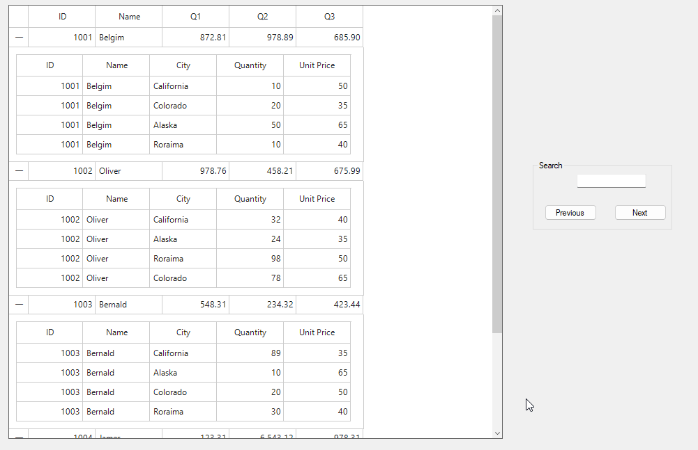

# How to perform search functionality in Master-Details view of WinForms DataGrid?

In [WinForms DataGrid](https://www.syncfusion.com/winforms-ui-controls/datagrid) (SfDataGrid), the Master-details view enables searching of data through [SearchController.Search](https://help.syncfusion.com/cr/windowsforms/Syncfusion.WinForms.DataGrid.SearchController.html#Syncfusion_WinForms_DataGrid_SearchController_Search_System_String_) method in the [GridViewDefinition.DataGrid](https://help.syncfusion.com/cr/windowsforms/Syncfusion.WinForms.DataGrid.GridViewDefinition.html#Syncfusion_WinForms_DataGrid_GridViewDefinition_DataGrid). Additionally, navigation to the previous and next cells matching the search text is supported using the [SearchController.FindPrevious](https://help.syncfusion.com/cr/windowsforms/Syncfusion.WinForms.DataGrid.SearchController.html#Syncfusion_WinForms_DataGrid_SearchController_FindPrevious_System_String_) and [SearchController.FindNext](https://help.syncfusion.com/cr/windowsforms/Syncfusion.WinForms.DataGrid.SearchController.html#Syncfusion_WinForms_DataGrid_SearchController_FindNext_System_String_) methods.

```csharp
SfDataGrid detailsViewGrid;
this.sfDataGrid1.AutoGeneratingRelations += OnAutoGeneratingRelations;

private void OnAutoGeneratingRelations(object sender, AutoGeneratingRelationsEventArgs e)
{
    // To get the DeatilsView dataGrid
    detailsViewGrid = e.GridViewDefinition.DataGrid;
}

private void OnTextChanged(object sender, EventArgs e)
{
    // To perform search in DetailsView DataGrid
    detailsViewGrid.SearchController.Search(this.textBox1.Text);
}

private void previousButtonClick(object sender, EventArgs e)
{
    // To navigate the previous cell match with search text
    if (detailsViewGrid.SearchController.FindPrevious(this.textBox1.Text))
    {
        var detailsViewGrid = sfDataGrid1.GetDetailsViewGrid(this.sfDataGrid1.SearchController.CurrentRowColumnIndex.RowIndex);
        detailsViewGrid.MoveToCurrentCell(detailsViewGrid.SearchController.CurrentRowColumnIndex);
    }            
}

private void nextButtonClick(object sender, EventArgs e)
{
    // To navigate the next cell match with search text
    if (detailsViewGrid.SearchController.FindNext(this.textBox1.Text))
    {
        var detailsViewGrid = sfDataGrid1.GetDetailsViewGrid(this.sfDataGrid1.SearchController.CurrentRowColumnIndex.RowIndex);
        detailsViewGrid.MoveToCurrentCell(detailsViewGrid.SearchController.CurrentRowColumnIndex);
    }
}
```


Take a moment to peruse the [WinForms DataGrid - Search](https://help.syncfusion.com/windowsforms/datagrid/search) documentation, where you can find about the search with code examples.
